# Anime Adventure Lab

Portfolio demo for an AI-driven anime adventure platform.

Anime Adventure Lab combines a story engine, world/lore management, RAG retrieval, agent tools, and text-to-image hooks into one playable visual-novel style workbench. The public demo is designed to be stable and interview-friendly: it uses deterministic mock/sample data, so reviewers can understand the architecture without downloading models or using a GPU.

> 中文摘要：這是一個 AI 故事冒險平台作品集專案，展示 Story Engine、RAG、Agent、T2I、WorldPack、背景任務與展示型部署流程。公開展示版以穩定 mock demo 為主；真模型/GPU 推論保留為進階本機模式。

## Live Demo

| Asset | Link | Purpose |
| --- | --- | --- |
| Portfolio demo site | <https://justin21523.github.io/anime-adventure-lab/> | Interview-first product demo with scenario switching, screenshots, and recording |
| Portfolio detail page | <https://justin21523.github.io/zh-TW/projects/anime-adventure-lab/> | Main portfolio case-study page with embedded media |
| GitHub repository | <https://github.com/Justin21523/anime-adventure-lab> | Source code, README, CI, and deployment setup |
| Demo recording | `portfolio-web/assets/demo-recording.mp4` | Short video artifact for reviewers |
| Screenshot gallery | `portfolio-web/assets/screenshot-*.svg` | Ready-to-share visual proof points |

## At A Glance

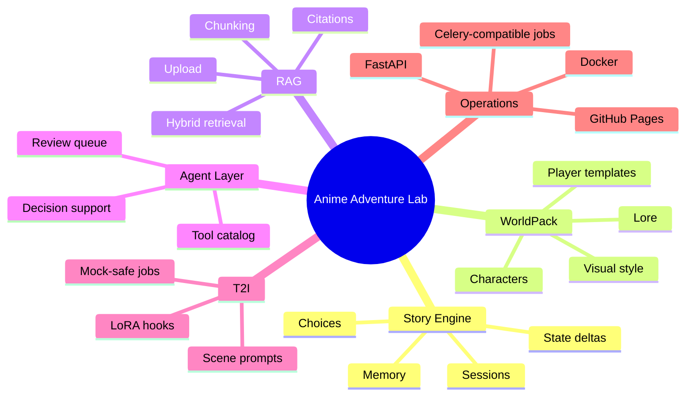

## Demo Screens

| Story-first gameplay | RAG retrieval evidence | Agent-assisted decision |
| --- | --- | --- |
| 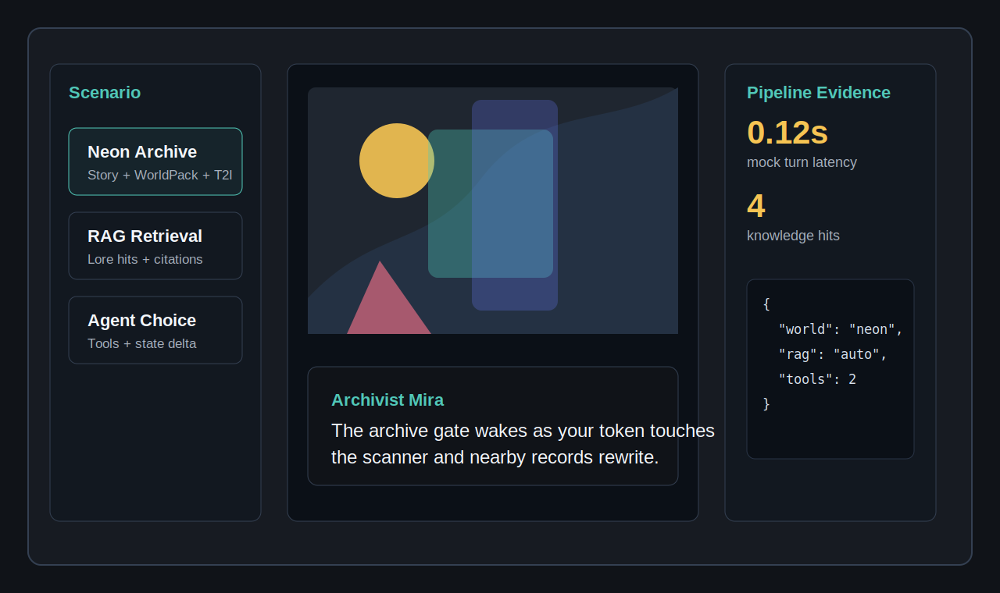 | 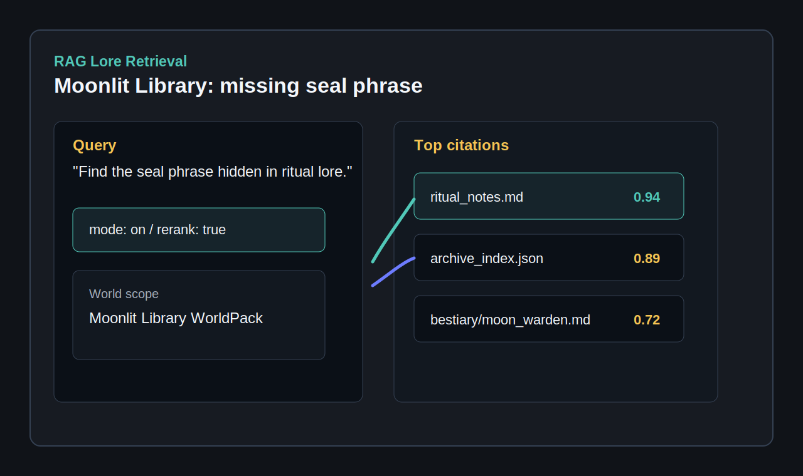 | 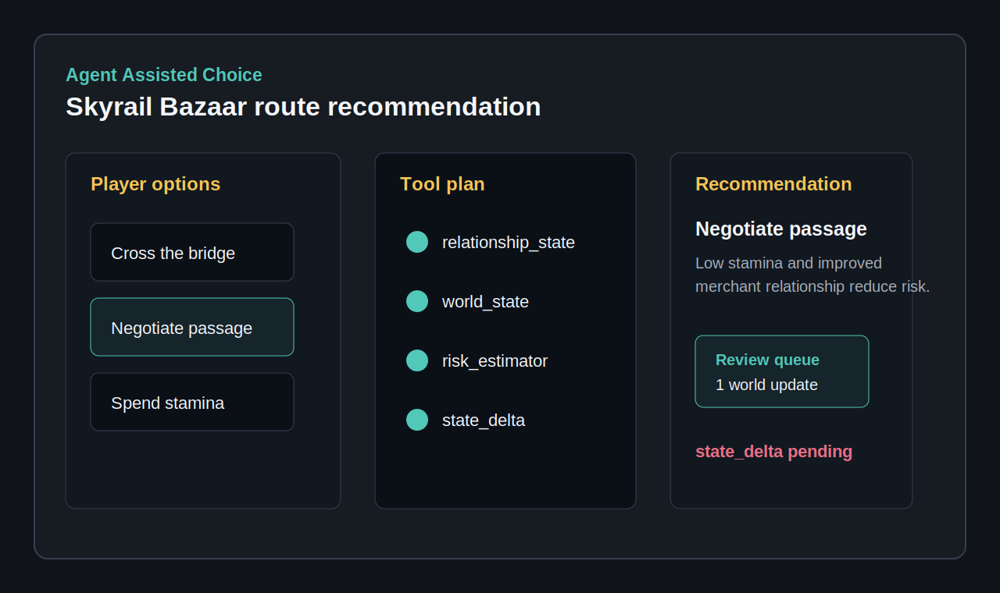 |

## What It Demonstrates

| Capability | What the reviewer sees | Implementation area |
| --- | --- | --- |
| Story Engine | A visual-novel style turn with speaker, narrative, choices, and state deltas | `core/story/`, `api/routers/story.py` |
| WorldPack | Reusable worlds with characters, lore, visual style, and player templates | `core/worldpacks/`, `docs/worldpack_format.md` |
| RAG Pipeline | World-scoped lore retrieval, rerank traces, citations, and stats | `core/rag/`, `api/routers/rag.py` |
| Agent Layer | Tool planning, state checks, recommendations, and reviewable changes | `core/agents/`, `api/routers/agent.py` |
| T2I Hooks | Scene prompt generation, mock image jobs, LoRA/ControlNet integration points | `core/t2i/`, `api/routers/t2i.py` |
| Demo Ops | Mock-safe backend, static portfolio demo, GitHub Pages deployment, smoke CI | `scripts/`, `.github/workflows/`, `portfolio-web/` |

## System Architecture

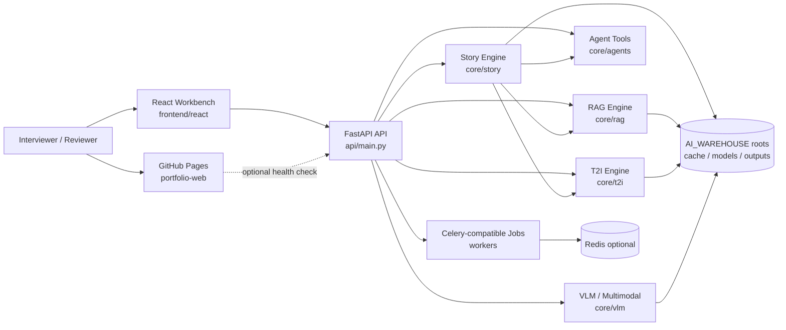

## Request And Data Flow

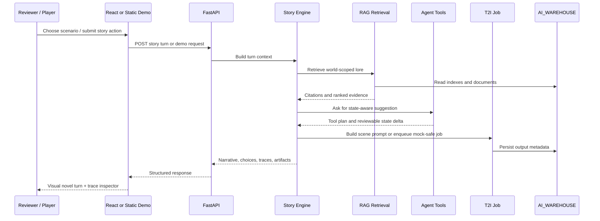

## Demo Scenario Map

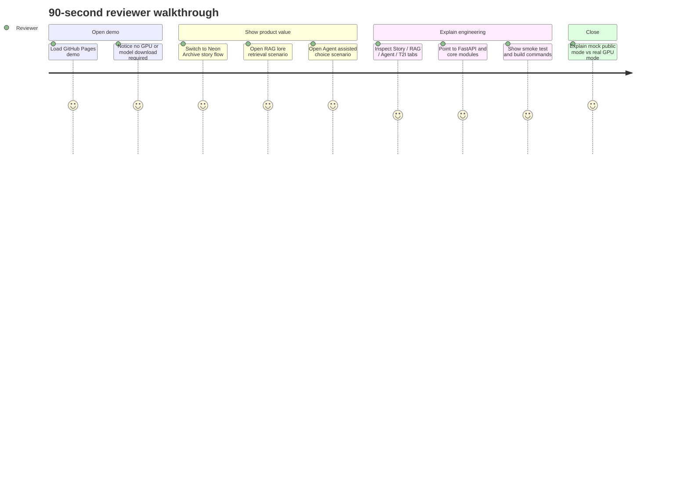

## Runtime Modes

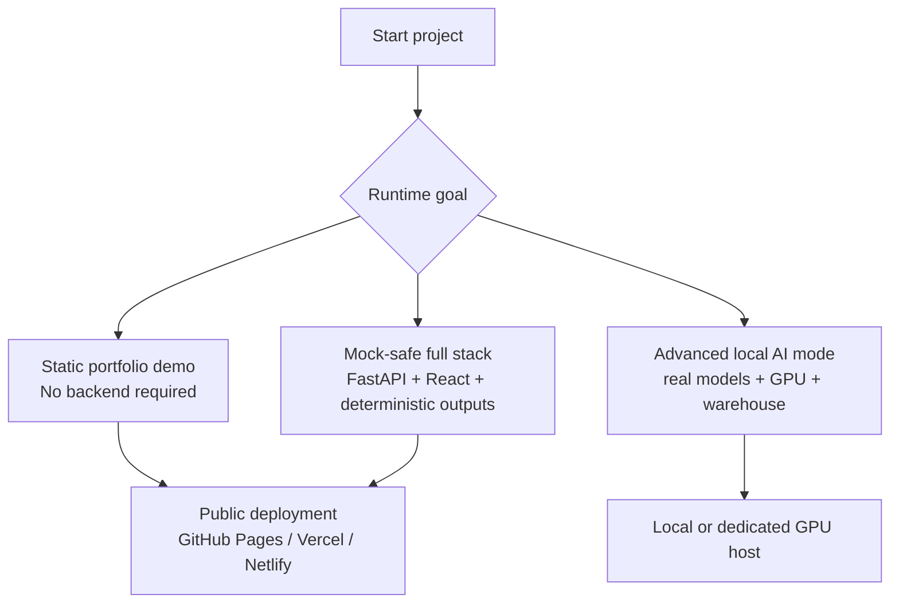

| Mode | Best for | Requirements | Command |
| --- | --- | --- | --- |
| Static portfolio | Public interviews, quick review, screenshots | Browser only | `cd portfolio-web && python -m http.server 4173` |
| Mock-safe backend | API demo, smoke tests, local no-GPU testing | Python env, no model downloads | `T2I_MOCK=1 VLM_MOCK=1 LLM_MOCK=1 uvicorn api.main:app --reload` |
| React workbench | Full UI walkthrough | Node + API | `cd frontend/react && npm run dev` |
| Real GPU mode | Advanced local inference | AI warehouse, model files, GPU/CPU tuning | Configure `.env` and model roots |

## Repository Organization

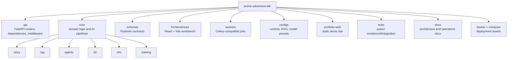

```text
portfolio-web/        Static interview demo and scenario showcase
frontend/react/       React + Vite visual novel/workbench UI
api/                  FastAPI app, routers, dependencies, middleware
core/                 Story, RAG, Agent, T2I, VLM, training, monitoring logic
schemas/              Shared Pydantic request/response models
workers/              Celery tasks and job execution wrappers
configs/              Runtime, model, RAG, training, and style presets
tests/                Pytest smoke/unit/integration coverage
docker/               Demo/frontend/backend Docker assets
docs/                 Technical notes, WorldPack format, RAG and deployment docs
```

## Technical Stack

```mermaid
flowchart LR
  subgraph Frontend
    vite[React 19 + Vite]
    tanstack[TanStack Query / Router]
    ui[Tailwind + Radix UI]
    state[Zustand]
  end

  subgraph Backend
    fastapi[FastAPI]
    pydantic[Pydantic schemas]
    celery[Celery-compatible job layer]
    redis[Redis optional]
  end

  subgraph AI_Core
    llm[LLM adapters<br/>llama.cpp / transformers]
    rag[FAISS + BM25 + bge-m3]
    t2i[Diffusers / LoRA / ControlNet hooks]
    vlm[VLM module]
    agents[Tool registry and agents]
  end

  subgraph Ops
    docker[Docker Compose]
    gha[GitHub Actions]
    pages[GitHub Pages]
    warehouse[AI_WAREHOUSE roots]
  end

  Frontend --> Backend
  Backend --> AI_Core
  AI_Core --> Ops
```

| Layer | Technologies |
| --- | --- |
| API | FastAPI, Pydantic, middleware, modular routers |
| Story | custom story/session engine, memory summaries, choices, state deltas |
| RAG | document processing, chunking, FAISS, BM25, rerank hooks, citations |
| Agents | tool registry, file/math/search/RAG tools, reviewable suggestions |
| T2I | Diffusers-style interfaces, LoRA manager, ControlNet hooks, prompt generation |
| Frontend | React 19, Vite, TypeScript, TanStack Query/Router, Tailwind, Radix UI, Zustand |
| Jobs | Celery-compatible worker tasks, Redis optional, sync fallback for demo |
| Deployment | GitHub Pages, Docker Compose, GitHub Actions |

## API Surface

```mermaid
flowchart LR
  client[Client]
  health[/healthz<br/>/ready]
  story[/api/v1/story<br/>sessions, turns, worlds]
  worlds[/api/v1/worlds<br/>WorldPack]
  rag[/api/v1/rag<br/>upload, stats, retrieval]
  t2i[/api/v1/t2i<br/>status, jobs, generation]
  agent[/api/v1/agent<br/>tools and actions]
  runtime[/api/v1/runtime<br/>presets and config]
  training[/api/v1/training<br/>simulated lifecycle]

  client --> health
  client --> story
  client --> worlds
  client --> rag
  client --> t2i
  client --> agent
  client --> runtime
  client --> training
```

| Endpoint area | Demo readiness | Notes |
| --- | --- | --- |
| Health/ready | Stable | Used by smoke tests and optional static demo health check |
| Story/worlds | Stable in mock mode | WorldPack and legacy story worlds are demo-safe |
| RAG upload/stats | Stable in smoke mode | Sync fallback avoids requiring a live worker |
| T2I status | Stable in mock mode | Reports mock engine status without loading large models |
| Agent tools | Stable enough for demo | Shows registered tool surface |
| Runtime presets | Stable | Handles external server presets and empty model names |
| Training jobs | Simulated smoke flow | Good for lifecycle demonstration, not real training evidence |

## Deployment Topology

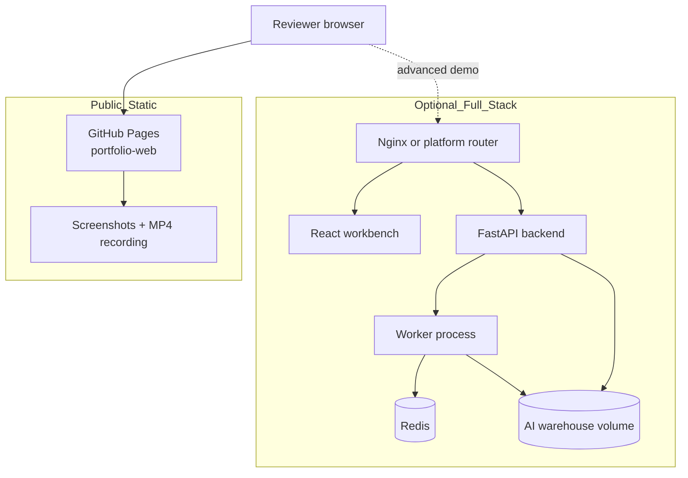

Recommended public path:

- GitHub Pages hosts `portfolio-web/`.
- The portfolio detail page embeds screenshots and the MP4 recording.
- Backend-heavy or GPU-heavy flows stay local unless a suitable host is available.

## AI Warehouse Layout

Data and generated artifacts are intentionally outside the repo:

```bash
AI_CACHE_ROOT=/mnt/c/ai_cache
AI_MODELS_ROOT=/mnt/c/ai_models
AI_OUTPUT_ROOT=/mnt/c/ai_output/anime-adventure-lab
AI_DATASETS_ROOT=/mnt/c/ai_datasets/anime-adventure-lab
```

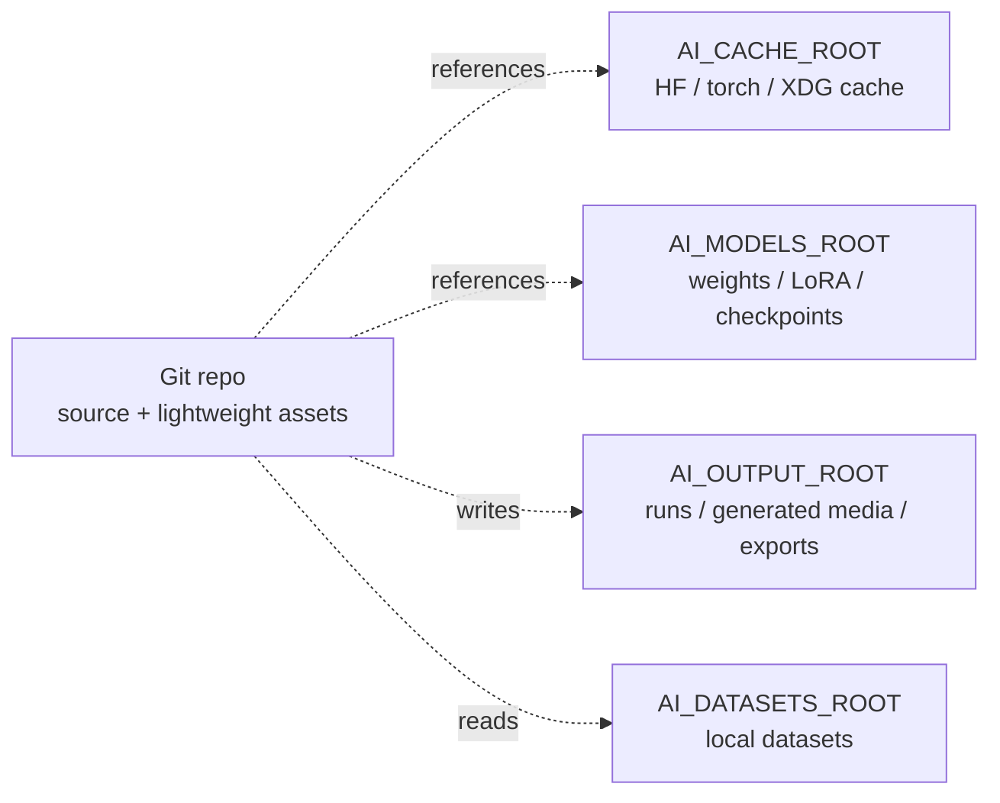

## Quick Start: Stable Mock Demo

Backend smoke mode:

```bash
conda create -n ai_env python=3.10 -y
conda activate ai_env
pip install -r requirements.txt -r requirements-test.txt

export T2I_MOCK=1 VLM_MOCK=1 LLM_MOCK=1
export MODEL_DEVICE=cpu CUDA_VISIBLE_DEVICES=
export JOBS_SYNC_FALLBACK=1

uvicorn api.main:app --reload
# http://localhost:8000/healthz
# http://localhost:8000/docs
```

React workbench:

```bash
cd frontend/react
npm ci
npm run dev
# http://localhost:3000
```

Static portfolio demo:

```bash
cd portfolio-web
python -m http.server 4173
# http://localhost:4173
```

## Verification

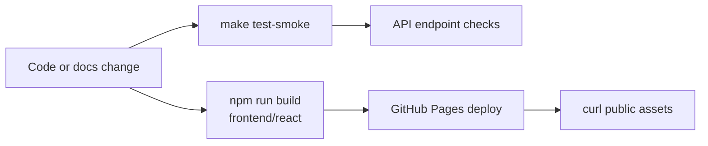

Recommended portfolio gate:

```bash
make test-smoke
cd frontend/react && npm ci && npm run build
```

Direct endpoint checks in mock mode:

```bash
curl http://localhost:8000/healthz
curl http://localhost:8000/api/v1/ready
curl http://localhost:8000/api/v1/worlds
curl http://localhost:8000/api/v1/runtime/presets
curl http://localhost:8000/api/v1/t2i/status
```

Notes:

- `make test-smoke` is the current reliable demo gate.
- The broader historical test/lint suite still contains legacy quality debt and is not used as the portfolio readiness gate yet.
- Real model, GPU, diffusers export, and large training flows are intentionally outside the default public demo path.

## Recording Flow

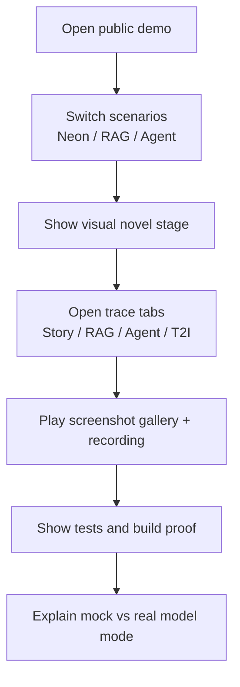

1. Open `portfolio-web/` or the public GitHub Pages demo.
2. Switch through the three showcase scenarios.
3. Show the visual novel stage and metrics.
4. Open the trace tabs to explain Story, RAG, Agent, and T2I data flow.
5. Show the screenshot gallery and play the embedded demo recording.
6. Run `make test-smoke`.
7. Run `cd frontend/react && npm run build`.
8. Close by explaining the split between stable public mock demo and optional real GPU/model mode.

## Current Status

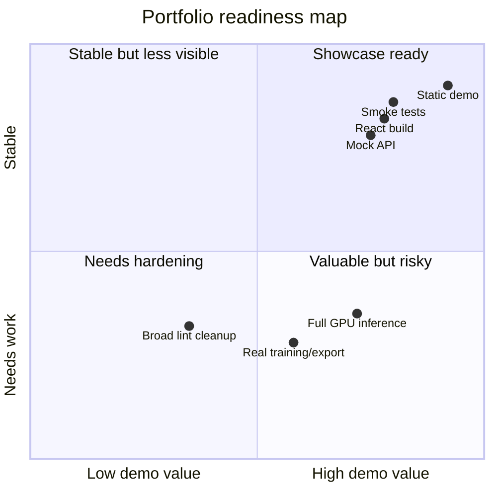

This repo is now organized around a portfolio-first demo path:

- Mock-safe backend startup and smoke tests.
- Static demo page for screenshots and recordings.
- React production build path.
- GitHub Pages deployment for public review.
- Portfolio detail page integration with screenshots and MP4 recording.
- README and CI aligned with the current project structure.

Remaining non-blocking work:

- Reduce broader lint debt.
- Expand real model/GPU documentation with exact hardware presets.
- Add more polished sample stories and generated image assets.
- Add Playwright-based screenshot capture for the React workbench.
- Convert additional API flows into recorded walkthroughs.

## Interviewer Highlights

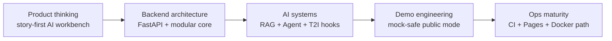

- The project is not just a chat UI; it is structured around story turns, world state, citations, tools, and scene artifacts.
- Public demo mode is deterministic and reviewable without GPU dependencies.
- The backend is split by domain boundaries rather than one-off endpoint handlers.
- The RAG and agent flows are presented as inspectable evidence, not hidden behind a black box.
- The repository now includes a full path from code to demo page to portfolio case study.

License: Apache-2.0 (TBD).
