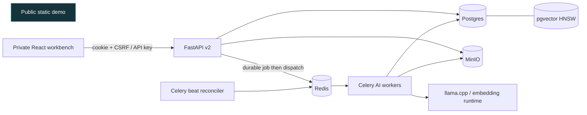

# Story-first v2 Architecture

## Product boundary

The supported product is a single-creator Story workbench. Story, WorldPack,
world-scoped RAG, durable jobs, and human-reviewed proposals are core. T2I,
VLM, training, model export, post-processing, Gradio, and desktop clients are
experimental and are not part of the production readiness claim.

The public portfolio demo and the private full application are separate apps:

- `portfolio-web/` is deterministic, anonymous, and stateless.
- `frontend/react/` plus `api/` is private, authenticated, and persistent.
- AI model runtimes belong to workers; the API process must remain CPU-light.



## Persistence

Postgres is the source of truth for worlds, sessions, turns, jobs, documents,
chunks, artifacts, and review proposals. pgvector stores world-scoped chunk
embeddings. MinIO stores uploads, generated media, and exports. Redis/Celery
coordinates long-running work but is not the authoritative job history.

Run migrations with:

```bash
alembic upgrade head
```

Preview legacy JSON import without writes:

```bash
python scripts/import_legacy_data.py
python scripts/import_legacy_data.py --apply
```

## API evolution

New transactional resources live under `/api/v2`. Existing v1 Story, World,
RAG, and T2I routes remain temporary compatibility endpoints. Generic Agent
tool execution is disabled by default and is not part of the v2 contract.

Mutating requests are not automatically retried. `POST
/api/v2/story-sessions/{session_id}/turns` requires `Idempotency-Key`; the API
creates the turn and durable job in one transaction and serializes turns per
session. Redis/Celery dispatch failure leaves a queryable queued job instead of
losing the request.

The private browser app authenticates with an HttpOnly signed session cookie.
Passwords are stored as Argon2 hashes and unsafe requests require a matching
CSRF cookie/header pair. API keys remain available for CLI and automation.

## Retrieval and recovery

Story RAG uses the same embedding boundary as document indexing. Production
orders world-filtered chunks with pgvector cosine distance; SQLite tests use a
deterministic cosine fallback. `auto` records retrieval degradation, `on` fails
closed, and `off` skips retrieval. Persisted citations contain source, chunk,
excerpt, position, and normalized score.

A job claim stores a Celery execution ID and a 35-minute lease. Redelivery with
the same execution ID is idempotent, while a superseded worker cannot complete
a newer attempt. Celery beat re-dispatches queued jobs after a grace period,
reclaims expired leases, and fails work after the configured attempt ceiling.
